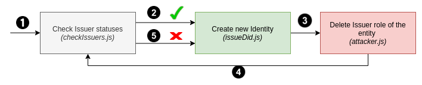

# Proof of Concept

This project contains the Proof of Concept that exploits one of the vulnerabilities found in the thesis. 

The main files are:

- **_attacker.js_**: attack script that disables the entity's ability to create identities.
- **_checkIssuers.js_**: checks whether the entity and the attacker have the Issuer role.
- **_issueCredential.js_**: example code that makes the entity to issue credentials (not necessary in this PoC).
- **_issueDid.js_**: example code that makes the entity to issue identities (DIDs).

## How to run the code
1. Install Node v10 
2. Install dependencies with `npm install`
3. Run the scripts in the following order:

**Note** that, once the PoC has been executed, **the entity may not have the Issuer role**, so you will have to use the [Alastria examples](https://github.com/alastria/alastria-identity-example/blob/master/exampleIssuer/2.addIdentityIssuer.js) to reassign the Issuer role to the entity.
